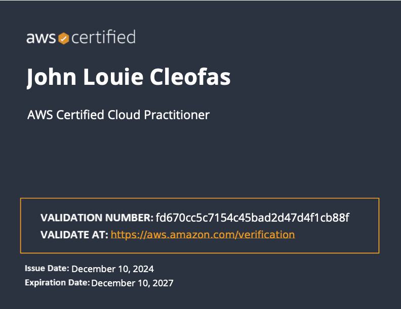
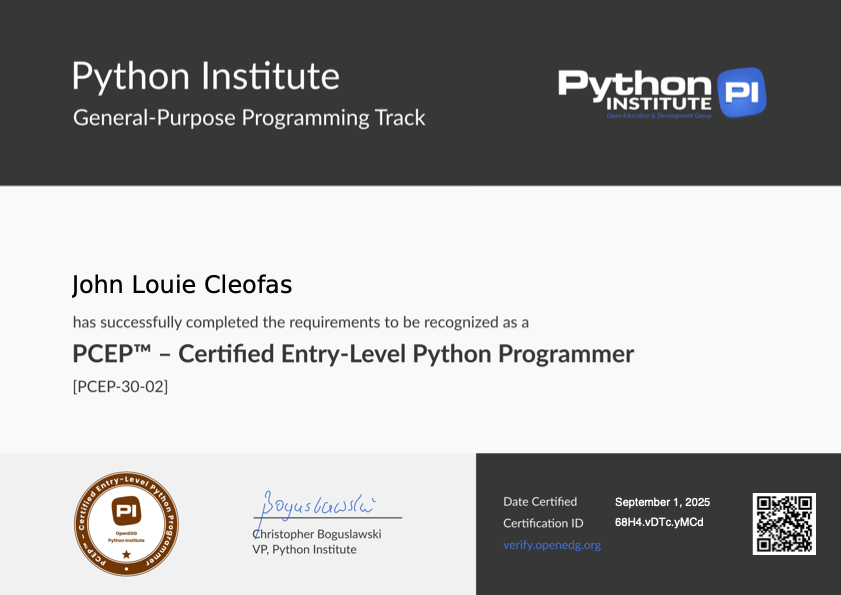
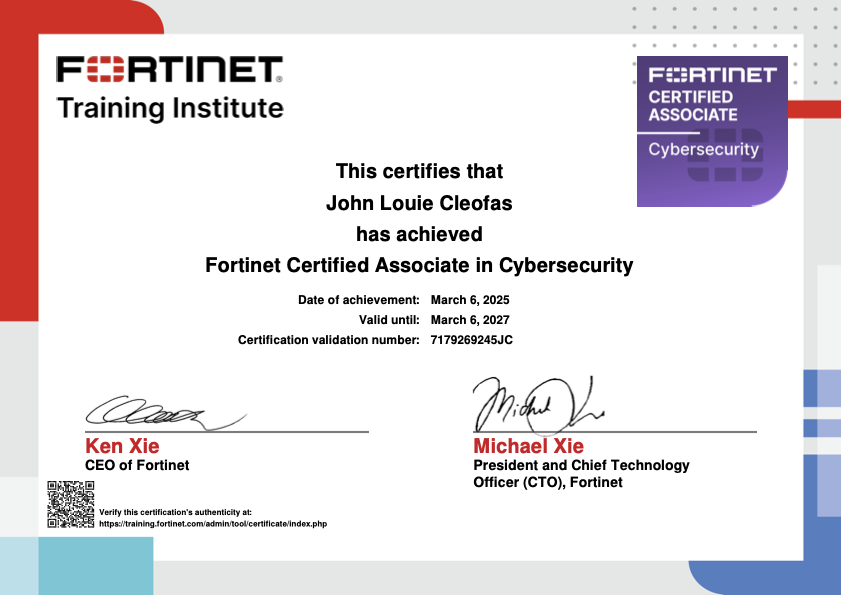

## Hi there 👋

<!--
**JLCleofas/JLCleofas** is a ✨ _special_ ✨ repository because its `README.md` (this file) appears on your GitHub profile.

Here are some ideas to get you started:

- 🔭 I’m currently working on ...
- 🌱 I’m currently learning ...
- 👯 I’m looking to collaborate on ...
- 🤔 I’m looking for help with ...
- 💬 Ask me about ...
- 📫 How to reach me: ...
- 😄 Pronouns: ...
- ⚡ Fun fact: ...
-->

My name is Louie and this is my personal repository.

About me:

I have a Bachelor's Degree in Electronics Engineering Major in Data Science.

I am experienced in both hardware and software engineering.

### Certifications
  - AWS Certified Cloud Practitioner
  
  - Python Certified Entry-Level Programmer
  
  - Fortinet Certified Associate in Cybersecurity
  

You may visit my cloud resume via this url: https://johnlouiecleofas.com
  - This cloud resume is built using AWS Cloud Technology

I am currently working on:
  - Enhancing my Python skills

I am currently studying:
  - For PCAP exam
  - APIs

I am currently working on an IoT project that involves Raspberry Pi and API.

